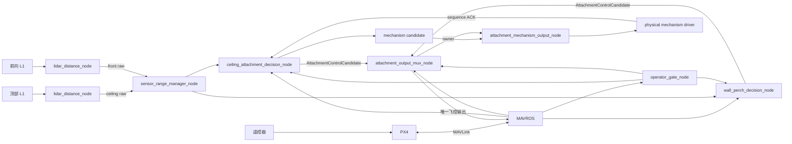

# 系统架构与实现边界

## 1. 当前主链路

当前生产方向是接触式吸顶与侧吸统一链路。旧的通用
FSM/controller/setpoint-mux 链路保留在 `scripts/legacy` 和
`launch/legacy`，只用于回归与兼容，不得与统一链路同时运行。

## 2. 分层职责

| Layer | Directory | Responsibility |
|---|---|---|
| Pure domain | `src/.../domain` | Geometry, sample holds, flight checks and owner transitions without ROS I/O |
| Boundary adapters | `src/.../adapters` | Convert odometry frames and build bounded MAVROS messages |
| Sensor I/O | `scripts/sensors` | Parse each L1 independently and publish raw ranges |
| Sensor management | `scripts/sensors` | Validate, age and fan out both channels without mode selection |
| Operator input | `scripts/operator` | Debounce two RC switches and reject conflicting requests |
| Decisions | `scripts/decisions` | Own ceiling/wall state machines and produce bounded candidates |
| Flight output | `scripts/outputs` | Lock one owner, validate freshness/state/odom and publish MAVROS setpoints |
| Mechanism output | `scripts/outputs` | Gate physical commands by owner and matching sequence acknowledgement |
| Bench support | `scripts/test_support` | Provide isolated mock PX4 and mechanism feedback |
| Legacy | `scripts/legacy` | Preserve the earlier generic distance-control prototype |

## 3. Topic contract

| Topic | Type | Publisher | Consumers |
|---|---|---|---|
| `/sensor/ceiling/raw` | `sensor_msgs/Range` | ceiling lidar | range manager |
| `/sensor/front/raw` | `sensor_msgs/Range` | front lidar | range manager |
| `/sensor/ceiling/range` | `sensor_msgs/Range` | range manager | both decisions |
| `/sensor/front/range` | `sensor_msgs/Range` | range manager | wall decision |
| `/sensor/health` | `SensorHealth` | range manager | wall decision, diagnostics |
| `/operator/command` | `OperatorCommand` | operator gate | decisions, output mux |
| `/ceiling_attachment/status` | `CeilingAttachmentStatus` | ceiling decision | diagnostics |
| `/wall_perch/status` | `WallPerchStatus` | wall decision | diagnostics |
| `/ceiling_attachment/control_candidate` | `AttachmentControlCandidate` | ceiling decision | output mux |
| `/wall_perch/control_candidate` | `AttachmentControlCandidate` | wall decision | output mux |
| `/attachment/output_owner` | `std_msgs/UInt8` | output mux | mechanism gate, diagnostics |
| `/attachment/output_mode` | `std_msgs/UInt8` | output mux | diagnostics |
| `/attachment/mechanism_candidate` | `AttachmentMechanismCommand` | ceiling decision | mechanism gate |
| `/attachment/mechanism_command` | `AttachmentMechanismCommand` | mechanism gate | physical driver |
| `/attachment/mechanism_status` | `AttachmentMechanismStatus` | physical/mock driver | ceiling decision |
| `/mavros/rc/in` | `mavros_msgs/RCIn` | MAVROS | output mux, mode manager when enabled |
| `/mavros/setpoint_raw/attitude` | `mavros_msgs/AttitudeTarget` | output mux | MAVROS/PX4 |
| `/attachment/rc_input_age_ms` | `std_msgs/Float32` | output mux | diagnostics |
| `/attachment/rc_preview_deg` | `geometry_msgs/Vector3Stamped` | output mux | bench diagnostics |

Deprecated aliases such as `/sensor/wall/range`, `/sensor/wall/top_range` and
`/sensor/selected_source` are not part of the current contract.

## 4. Safety invariants

1. Unified operation has exactly one MAVROS setpoint publisher:
   `attachment_output_mux_node`.
2. Owner can only be acquired from NONE. Ending or timing out an owner starts a
   neutral-switch dwell before another behavior can acquire it.
3. Both RC switches active is an immediate ABORT request and cannot acquire a
   new owner.
4. Range, state, odom, operator and candidate freshness are checked using local
   receive time; stale data is never treated as a new sample.
5. `candidate_valid=false` stops new setpoint publication while the current
   decision retains responsibility for completing its recovery path.
6. Flight output and physical mechanism output have independent, default-off
   master enables.
7. This package never arms PX4. The terminal flight entry requests OFFBOARD
   after a verified neutral setpoint prestream, and requests ALTCTL only after
   controlled detach and recovery complete.
8. The output mux only understands the generic control-candidate contract; it
   does not branch on ceiling or wall state-machine enums.

## 5. Coordinate boundary

- MAVROS odometry is consumed with ROS ENU world and FLU body conventions.
- Local and attitude setpoints are populated with ROS-side conventions; MAVROS
  performs the PX4 NED/FRD conversion.
- `nav_msgs/Odometry.pose` belongs to `header.frame_id`, while `twist` belongs
  to `child_frame_id`. `adapters/odometry.py` now rotates child-frame linear
  velocity into the odometry parent frame before either behavior applies its
  vertical-speed gate. Set `odom_twist_in_child_frame=false` only for a
  non-conforming odometry source that already publishes world-frame twist.
- Range `frame_id` labels do not apply sensor extrinsics automatically. Mounting
  direction and tilt compensation still require explicit validation/TF logic.

## 6. Supported and legacy entry points

- Primary: `launch/system/attachment_system_mavros.launch`
- Sensor utility: `launch/sensors/lidar_dual.launch`
- Bench: `launch/bench/*.launch`
- Standalone ceiling compatibility: `launch/standalone/*.launch`
- Legacy generic chain: `launch/legacy/*.launch`

See `docs/bench_test_procedure.txt` before enabling any physical output.
