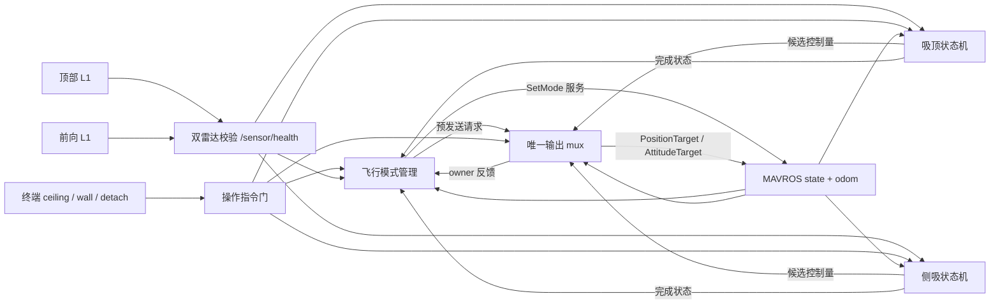

# 完整代码框架与合理性评估

## 目标与运行边界

目标流程：飞手以 `ALTCTL` 起飞并接近目标，终端选择吸顶或侧吸；ROS1 在
OFFBOARD 入口先预发送中性 setpoint，再请求切换模式；行为决策独占 MAVROS 输出；
收到脱离命令后完成恢复，最后请求 `ALTCTL` 交回飞手。

生产入口为 `launch/system/attachment_terminal_flight.launch`。
`flight_enabled` 默认 `false`；只有显式设为 `true` 才允许切换模式和发布真实
setpoint。MAVROS 在另一终端单独启动。本包不解锁、不起飞、不自动降落。

## 源代码责任划分

| 层 | 文件 | 责任 |
|---|---|---|
| 传感器 | `scripts/sensors/lidar_distance_node.py`、`sensor_range_manager_node.py` | 两个串口独立解码、量测有效性和超时检查 |
| 操作指令 | `scripts/operator/terminal_operator_node.py` | 终端命令转为持续的 `OperatorCommand`，脱离命令送入对应状态机 |
| 模式交接 | `scripts/operator/flight_mode_manager_node.py` | 预发送 1.5 s；请求 OFFBOARD；正常脱离后请求 ALTCTL |
| 吸顶决策 | `scripts/decisions/ceiling_attachment_decision_node.py` | 接近、触顶、保持、脱离及安全分离确认 |
| 侧吸决策 | `scripts/decisions/wall_perch_decision_node.py` | 前距捕获、翻转、侧贴、脱离旋转及恢复 |
| 输出仲裁 | `scripts/outputs/attachment_output_mux_node.py`、`src/.../domain/owner_arbiter.py` | 唯一 MAVROS 发布者、互斥 owner、限幅和新鲜度检查 |
| 协议适配 | `src/.../adapters/mavros_setpoint.py`、`odometry.py` | ROS ENU/FLU 边界、MAVROS 消息生成、odom 数值校验 |
| 参数/接口 | `config/*.yaml`、`msg/*.msg` | 行为增益、阈值、话题契约 |
| 测试 | `test/*.py`、`launch/bench/*.launch` | 状态机安全门、模式交接和台架输出 |

`scripts/legacy`、`launch/legacy` 和 `scripts/standalone` 是兼容路径，不能和
统一生产入口同时运行。`attachment_mechanism_output_node.py` 为独立机构保留；
当前仅靠飞控推力的方案不需要物理机构驱动，生产入口关闭其输出并取消机构 ACK。

## 状态交接契约

| 条件 | 系统动作 | 验证点 |
|---|---|---|
| ALTCTL、已解锁、所需传感器及 odom 新鲜 | 50 Hz 姿态＋推力 setpoint 预发送 | `/attachment/flight_phase=PRESTREAM`；`/mavros/setpoint_raw/attitude` 有流 |
| 预发送连续至少 1.5 s | 请求 OFFBOARD | `/mavros/state.mode=OFFBOARD` |
| 行为进入执行态 | 输出 owner 为 1=吸顶或 2=侧吸；只有 mux 向 MAVROS 发控制量 | `/attachment/output_owner` 和行为状态 |
| 吸顶 `DETACH → RECOVERY_HOVER → NORMAL_FLIGHT` | owner 释放、机体水平及竖直速度稳定、遥控杆回中后请求 ALTCTL | 状态、owner=0、飞控 mode=ALTCTL |
| 侧吸 `DETACH_ROTATE → RECOVER → EXIT/IDLE` | 同样确认交接条件后请求 ALTCTL | 同上 |
| 故障、候选无效、PX4 外部切模式 | 抑制继续启动；飞手通过遥控器接管 | PX4 模式与失联保护行为 |

## 合理性结论

**软件结构合理的部分：** 双传感器数据独立校验；两种行为共用一个输出仲裁点；
OFFBOARD 前有高于 PX4 最低要求的持续 setpoint；切回 ALTCTL 以正常脱离
完成和 owner 释放为前提；输出及模式切换默认关闭。自动化测试覆盖 owner 互斥、
新鲜度、预发送与返回条件。

**尚不能从代码证明的部分：**

1. `odometry_is_finite()` 只能验证数据新鲜且为有限数值。统一入口已改用
   姿态＋推力设定值，模式管理节点要求姿态和竖直速度估计有效，不要求水平速度
   估计。它也不能自动制止水平漂移；实飞前仍需在 PX4/QGC 验证姿态与竖直速度。
2. `config/ceiling_attachment.yaml` 中 `hover_thrust=0.45` 已按 2026-09-22
   ALTCTL ULog 更新；接触距离、压缩量和脱离推力仍须用真实机架确认。
   无独立吸附机构时，必须用真实机架确认接触压缩和
   距离阈值；否则状态机可能永远无法确认贴顶。
3. `config/wall_perch.yaml` 已按2026-09-22 ULog使用 `hover_thrust=0.45`、
   接近推力0.47、翻转推力约0.608，并以顶部距离在0.675--0.75之间调节压墙推力；
   `wall_angle_deg=+90`、翻转时间及距离阈值仍需实测。正 `+45°` 方向由
   `pitch_45_test.py` 的台架
   结果确认，完整 `+90°` 幅度尚未验证。电机转速响应不等于侧吸姿态和推力已能安全
   支撑机体。提前接触时的目标姿态跳变已改为保持当前命令角度，但尚未经过动力学
   和接触实测验证。侧吸必须单独逐步标定。
4. 前向雷达必须通过 `front_serial_port` 传给生产 launch；只在
   `config/sensors.yaml` 写串口路径不足以启动前向节点。必须看到
   `/sensor/health.front_valid=true`。
5. 正常脱离失败时管理节点不会把故障当作成功而自动回 ALTCTL。飞手必须有
   已验证的遥控器模式接管路径，并在 PX4 中配置 `COM_OF_LOSS_T` 与
   `COM_OBL_RC_ACT`。程序不能替代机体结构和失联保护验证。

**当前判定：** 代码框架可以构建、启动和在台架验证输出链；不能仅凭这些结果
判定可直接进行接触式实飞。实飞放行还取决于悬停推力、传感器外参、机架接触
几何、竖直速度估计、PX4 失联动作，以及分阶段飞行记录。
